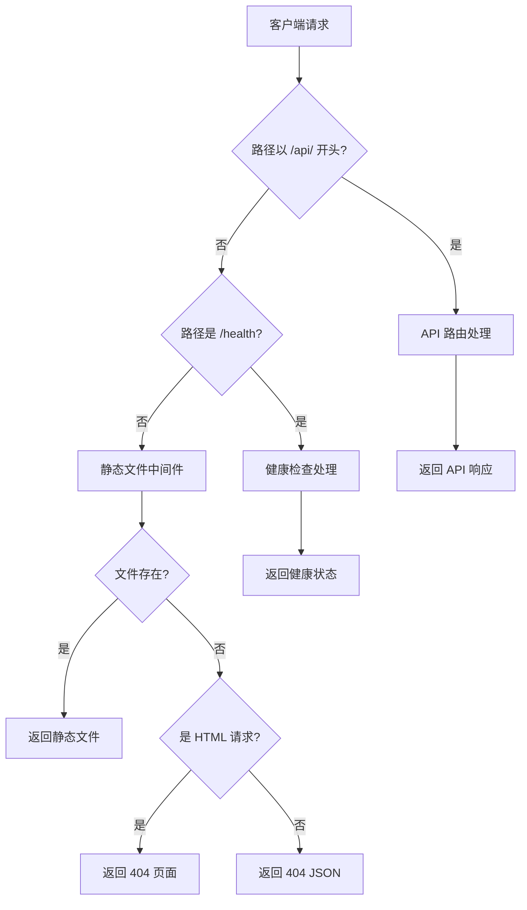

# 设计文档

## 概述

本设计文档描述如何将干细胞治疗档案管理系统的前端和后端合并为统一端口服务。通过修改 Express.js 服务器配置，使其同时提供 API 接口和静态文件服务，实现单一端口部署。

## 架构

### 当前架构

```
┌─────────────────┐     ┌─────────────────┐
│   前端服务器     │     │   后端服务器     │
│   (端口 8080)   │────▶│   (端口 5000)   │
│   静态文件服务   │     │   API 服务      │
└─────────────────┘     └─────────────────┘
```

### 目标架构

```
┌─────────────────────────────────────────┐
│           统一服务器 (端口 5000)          │
│  ┌─────────────────────────────────────┐│
│  │         Express.js 应用              ││
│  │  ┌───────────┐  ┌───────────────┐  ││
│  │  │ API 路由   │  │ 静态文件中间件  │  ││
│  │  │ /api/*    │  │ /public/*     │  ││
│  │  └───────────┘  └───────────────┘  ││
│  └─────────────────────────────────────┘│
└─────────────────────────────────────────┘
```

### 请求处理流程



## 组件和接口

### 1. 服务器配置模块 (server.js)

**职责**：配置 Express 应用，设置中间件顺序和路由优先级

**修改内容**：
- 添加静态文件中间件配置
- 调整中间件顺序确保 API 优先
- 添加 404 页面处理逻辑

```javascript
// 中间件顺序（从上到下）
1. helmet() - 安全头
2. cors() - 跨域配置
3. morgan() - 日志
4. express.json() - JSON 解析
5. API 路由 (/api/*)
6. 健康检查 (/health)
7. express.static() - 静态文件
8. 404 处理
9. 错误处理
```

### 2. 静态文件服务配置

**目录结构**：
```
backend/
├── public/                 # 静态文件目录（从 frontend 复制）
│   ├── index.html         # 重定向到 login.html
│   ├── login.html
│   ├── dashboard.html
│   ├── customers.html
│   ├── ... 其他 HTML 文件
│   ├── css/
│   │   ├── main.css
│   │   ├── tailwind.css
│   │   └── fontawesome/
│   ├── js/
│   │   ├── api.js
│   │   ├── app.js
│   │   └── ... 其他 JS 文件
│   ├── webfonts/
│   └── assets/
├── server.js
└── ... 其他后端文件
```

### 3. 前端配置模块 (config.js)

**修改内容**：
- 更新 API 基础地址检测逻辑
- 支持同源部署场景

```javascript
// 新的 API 地址检测逻辑
function getAPIBaseURL() {
    const currentPort = window.location.port;
    
    // 开发环境：前端独立运行在 8080 端口
    if (currentPort === '8080') {
        return `http://${window.location.hostname}:5000/api`;
    }
    
    // 生产环境：前后端合并，使用相对路径
    return '/api';
}
```

### 4. 部署脚本 (build.js)

**职责**：自动复制前端文件到后端 public 目录

**功能**：
- 清理旧的 public 目录
- 复制前端文件（排除 node_modules、tests）
- 创建根路径重定向文件

## 数据模型

本功能不涉及数据模型变更。

## 正确性属性

*正确性属性是指在系统所有有效执行中都应该保持为真的特征或行为——本质上是关于系统应该做什么的形式化陈述。属性作为人类可读规范和机器可验证正确性保证之间的桥梁。*

### 属性 1：静态文件路由正确性

*对于任意*存在于 public 目录中的静态文件，当请求该文件的路径时，服务器应返回正确的文件内容和 MIME 类型。

**验证：需求 1.2, 1.3, 1.4, 1.5, 1.6**

### 属性 2：API 路由完整性

*对于任意*以 `/api/` 开头的请求路径，如果该路径对应已注册的 API 端点，服务器应返回 API 处理结果而非静态文件。

**验证：需求 2.1, 2.3**

### 属性 3：配置环境适应性

*对于任意*运行环境（开发或生产），前端配置应返回正确的 API 基础地址，使 API 请求能够正确到达后端服务器。

**验证：需求 3.1, 3.3**

### 属性 4：响应格式正确性

*对于任意* API 请求，响应应为 JSON 格式；*对于任意*页面请求，响应应为 HTML 格式。

**验证：需求 6.2, 7.1**

### 属性 5：404 错误处理一致性

*对于任意*不存在的资源请求，服务器应根据请求类型（API 或页面）返回相应格式的 404 错误响应。

**验证：需求 1.7, 7.1, 7.2**

## 错误处理

### 静态文件错误

| 错误场景 | 处理方式 |
|---------|---------|
| 文件不存在 | 返回 404 错误页面 |
| 文件读取失败 | 记录错误日志，返回 500 错误 |
| MIME 类型未知 | 使用 application/octet-stream |

### API 错误

| 错误场景 | 处理方式 |
|---------|---------|
| 路由不存在 | 返回 JSON 格式 404 错误 |
| 服务器内部错误 | 记录日志，返回 JSON 格式 500 错误 |
| 请求参数错误 | 返回 JSON 格式 400 错误 |

### 错误响应格式

**API 错误响应**：
```json
{
    "status": "Error",
    "message": "错误描述信息",
    "code": 404
}
```

**页面错误响应**：
返回 HTML 格式的错误页面，包含友好的错误提示和返回首页链接。

## 测试策略

### 单元测试

使用 Jest 测试框架：

1. **配置模块测试**
   - 测试 `getAPIBaseURL()` 在不同环境下的返回值
   - 测试环境检测逻辑

2. **路由优先级测试**
   - 测试 API 路由是否优先于静态文件
   - 测试静态文件回退机制

### 属性测试

使用 fast-check 库进行属性测试：

1. **静态文件路由属性测试**
   - 生成随机文件路径，验证响应正确性
   - 最少运行 100 次迭代

2. **API 路由完整性属性测试**
   - 生成随机 API 路径，验证路由匹配
   - 最少运行 100 次迭代

### 集成测试

使用 Supertest 进行 HTTP 请求测试：

1. **静态文件服务测试**
   - 测试各类静态文件的访问
   - 测试 MIME 类型正确性

2. **API 端点测试**
   - 验证所有现有 API 端点仍然正常工作
   - 测试 API 和静态文件的路由隔离

### E2E 测试

使用 Playwright 进行端到端测试：

1. **页面加载测试**
   - 测试所有 HTML 页面能够正常加载
   - 测试静态资源（CSS、JS、字体）加载

2. **功能回归测试**
   - 验证合并后所有功能正常工作
